# Writing WebAssembly Hy Hand

This doc is based on https://developer.mozilla.org/en-US/docs/WebAssembly.

---

Let's see if I can implement FizzBuzz. Starting with a loop to print the numbers 0..99.

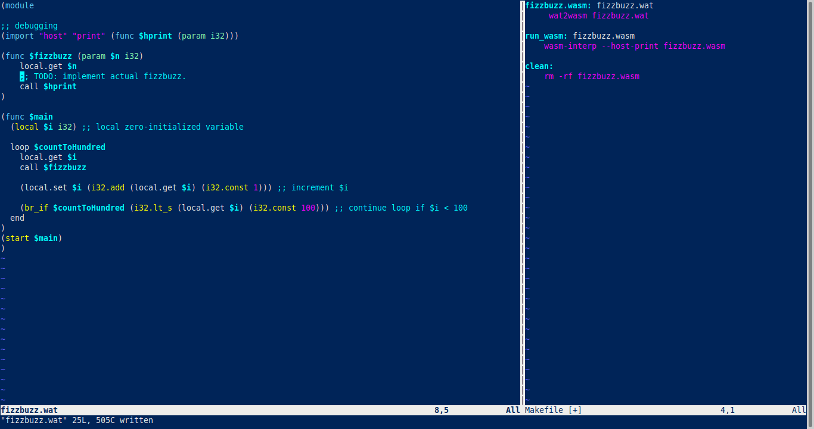

---

Here is the fizz buzz logic. The next step will be printing strings instead of the `i32` placeholders. This will be challenging, since WebAssembly does not have a native string type, nor does `wasm-interp` provide a way to print strings AFAICT.

---

To get strings out of wasm, looks like state of the art (non-representative survey) is to export the complete wasm memory (or import memory from the host environment) and share pointers into wasm memory as `i32` with the host environment.
I don't want to work with shared memory,...

---

I need more support from the host environment to print strings. Let's switch from `wasm-interp` to a browser. No change to the wasm code.
The fizzbuzz (still with numbers instead of strings) shows up in the JavaScript console.

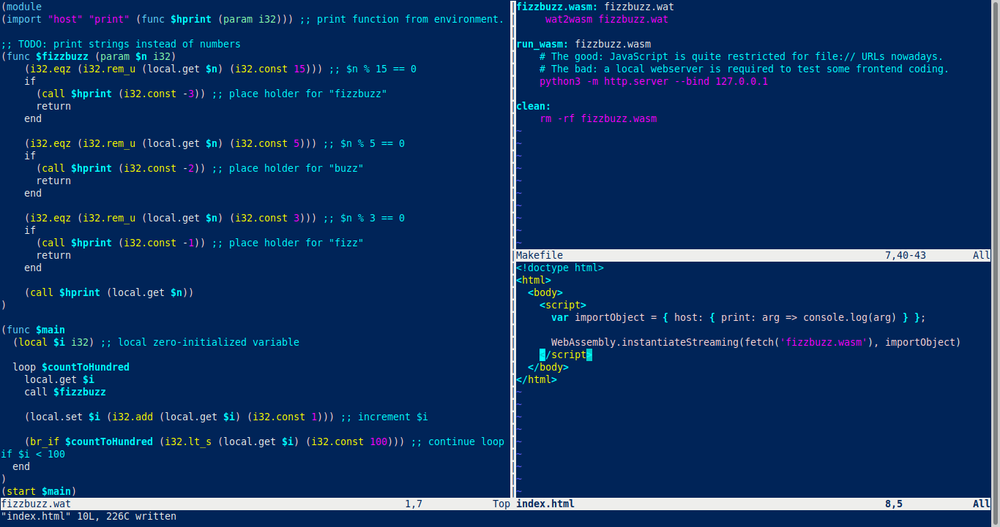
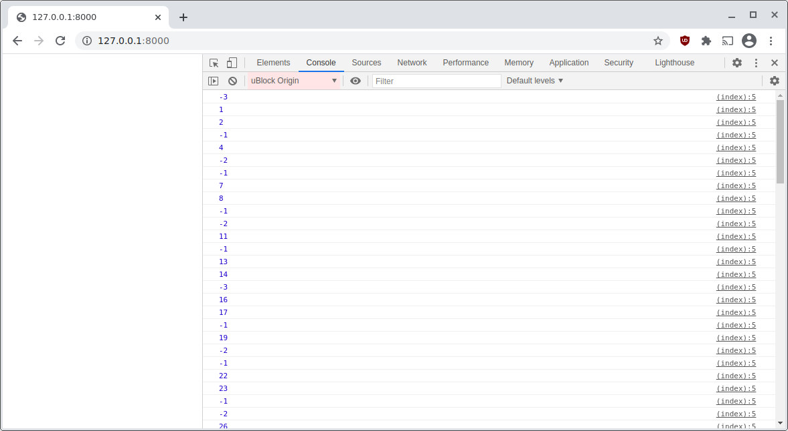

---

For reasons I don't understand, the .wasm file is executed, but the Chrome (version 87.0.4280.88 64bit Linux) dev tools debugger refuses to load the file.
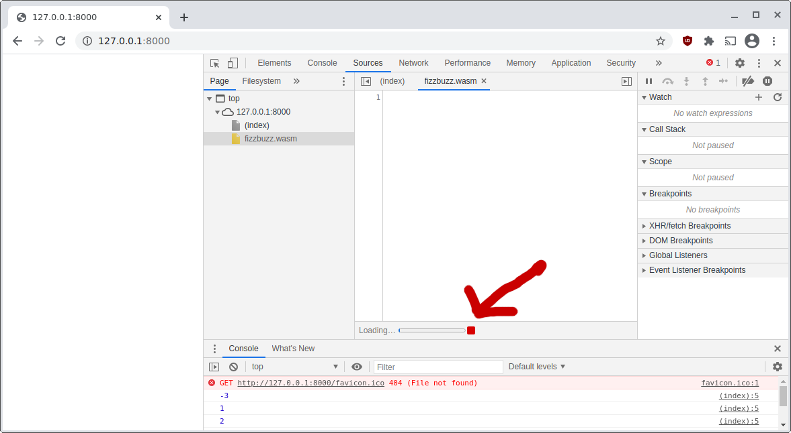

---

When I ask Chrome to `"Save as..."` the `fizzbuzz.wasm` and base64 decode it (wtf? Why is it base64 encoded? The python webserver definitely serves it as binary with `Content-type: application/wasm`) I get the same `fizzbuzz.wasm` I expect.
Let's ignore this, no wasm debugger for now.

Narrator: firefox will be my debugger

---

Calling the main function from JavaScript instead of `(start $main)` does not seem to make a difference. So let's not do this.
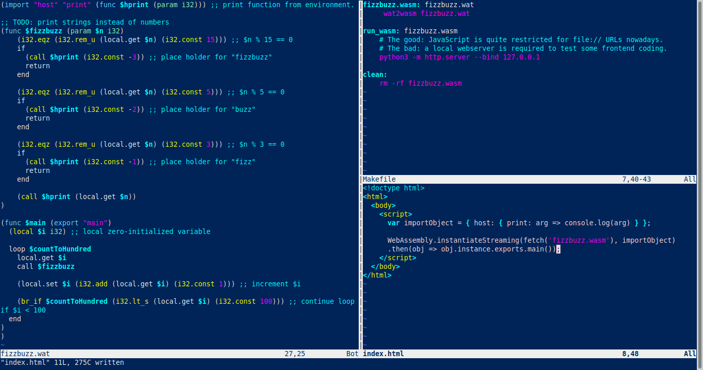

---

Let's get the FizzBuzz running! I'm cheating somewhat, since I moved the string processing to JavaScript. No changes to the wasm code.

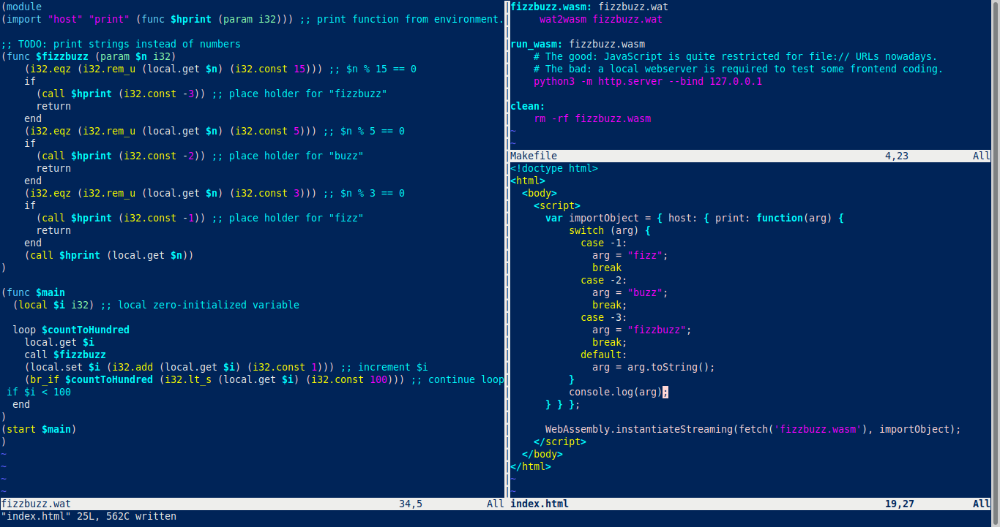
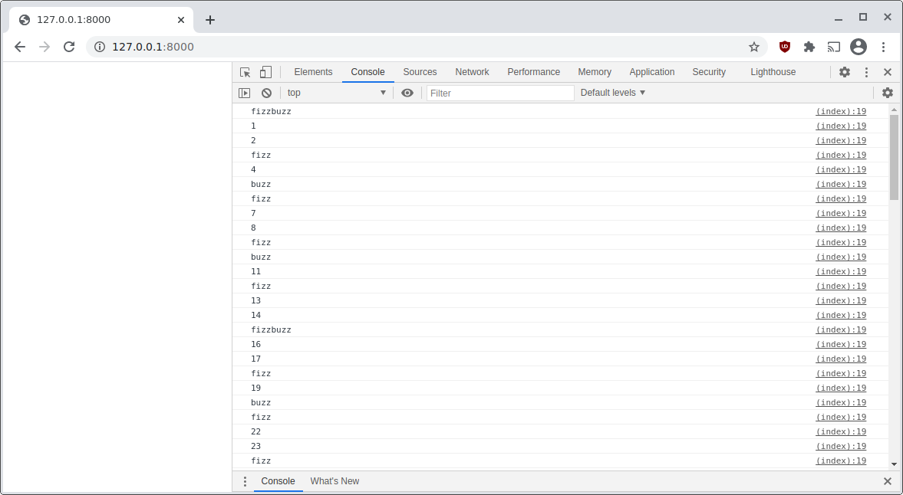

---

Since I don't want to communicate via shared memory, I'll write my own message-passing API :woman_shrugging:. Probably `putchar` and `getchar` will serve as API between browser and wasm. BRB, coding an ugly terminal. Let's start by getting rid of `console.log`. No change to wasm code.

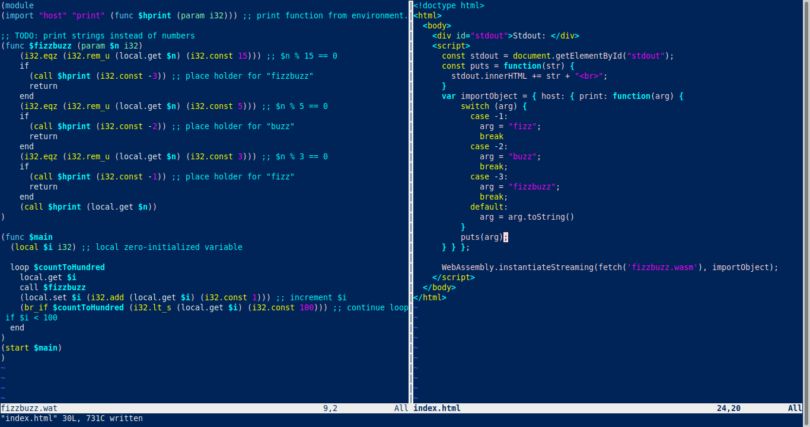
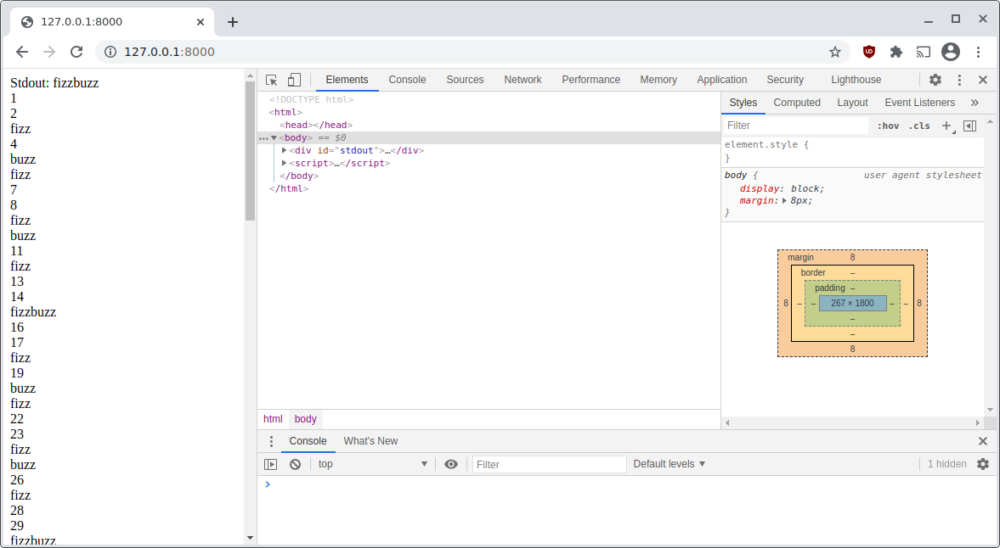

---

By providing a `putchar` function from javascript, the WebAssembly code can directly write chars to the HTML. One char at a time, but I guess I gave up on performance for this demo long ago.
Now, the string functions can be moved to WebAssembly.

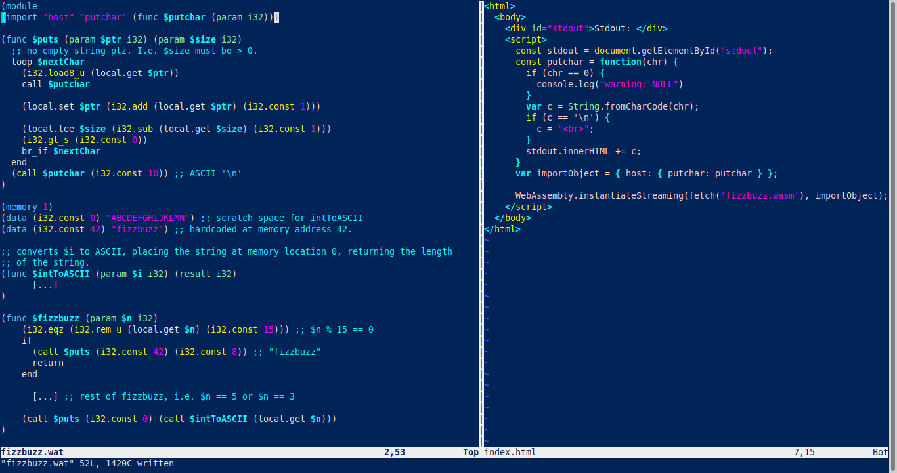

---

These may be the worst string functions you will see today. But I know that you will take a look :stuck_out_tongue_winking_eye:

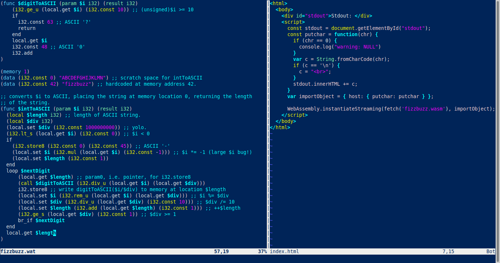
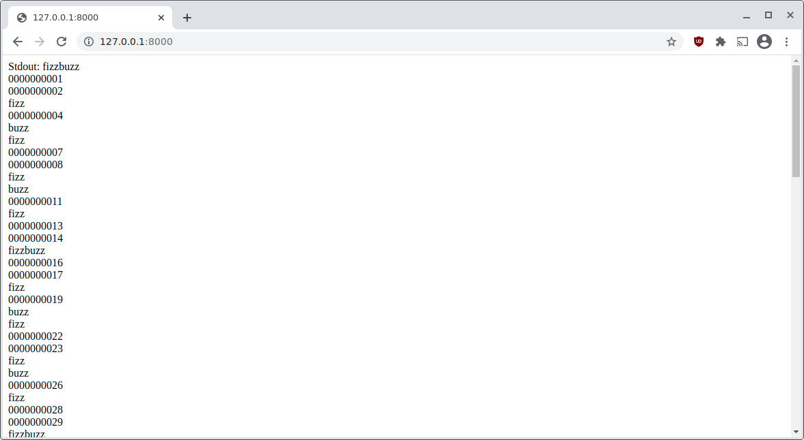

---

Time to switch to a real terminal emulator.
Thanks to @larsr_h for teaching me how to avoid `npm` with @unpkg.

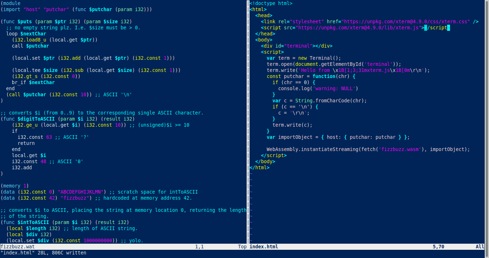
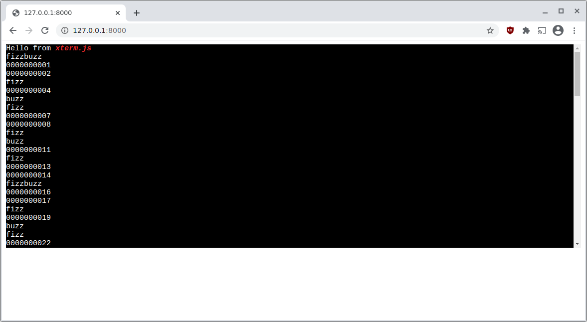

---

Terminal emulator in the browser, this is how the web was meant to be, right?
Maybe I should wire this wasm to a real serial terminal via WebUSB?
I hope nobody notices that I'm a backend person. I have no frontend skills.

:impostor:

